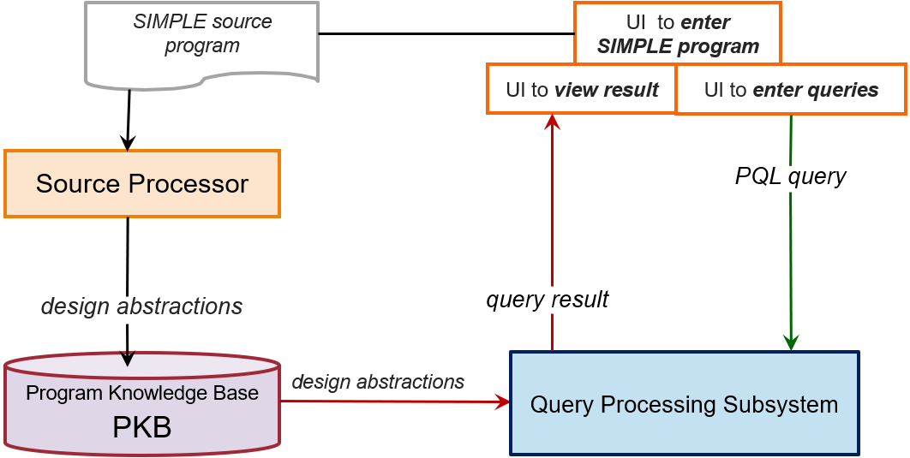

 

<frontmatter>
  layout: default.md
  pageNav: 2
  pageNavTitle: "Chapters of This Page"
</frontmatter>

Motivation
=========================

Some companies spend ~80% of software budgets on software maintenance. During software maintenance, programmers spend ~50% of the time understanding a program. Therefore, methods and tools that can ease program understanding can cut development costs substantially.

During program maintenance, programmers often try to locate code relevant to the maintenance task at hand. Here are examples of questions programmers might ask to locate code of interest:

*   I need to find code that implements salary computation rules!
*   Where is variable `x` modified? Where is it used?
*   I need to find all statements with the sub-expression `x * y + z`!
*   Which statements affect the value of `x` at statement #120?
*   Which statements can be affected if I modify statement #20?

A programmer may need to examine a large amount of code to answer those questions. Doing this by hand may be time-consuming and error-prone.

Static Program Analyzer (SPA)
=============================================================

A **Static Program Analyzer (SPA)** is an interactive tool that automatically answers queries about programs. We will design and implement a SPA for the SIMPLE programming language.

The SPA can be used by users (programmers) in the following way:

1.  John, a programmer, is given a task to fix a crashing error in a program.
2.  He feeds the program into SPA for automated analysis. The SPA parses a program into the internal representation stored in a Program Knowledge Base (PKB).
3.  He starts using the SPA to help him find program statements that cause the crash by entering queries. The SPA evaluates the queries and displays the results.
4.  He analyzes query results and examines related sections of the program to locate the source of the error.
5.  He finds program statement(s) responsible for an error and modifies the program to fix the error. He can ask the SPA with more queries to examine the possible unwanted ripple effects of the changes.

From the users' point of view, static analysis requires three actions:

1.  Enter the source program
2.  Enter queries
3.  View query results

How It Works
=============================

SPA works by:

1.  Analyzing a [source program](simple-programming.html) and extract relevant [program design entities](design-entities.html), [program design abstractions](design-abstractions.html), [Abstract Syntax Tree (AST)](abstract-syntax-tree.html), and program Control Flow Graph (CFG)
2.  Storing the information in a PKB
3.  Providing the user with the means to ask queries written in a formal [Program Query Language (PQL)](program-query-language\introduction.html)
4.  Processing the PQL queries based on the information found in the PKB
5.  Returning the results to the user

[Figure 1](#figure-1-spas-main-components) shows the SPA's main components:

*   The User Interface (UI) allows users to enter a source program written in SIMPLE.
*   The **Source Processor** parses the source program. It extracts information and stores the information in the **PKB**.
*   The UI also allows users to input PQL queries.
*   The **Query Processing Subsystem** validates and evaluates the queries by making use of the information stored in the PKB.
*   The UI then display the query results to the user.

##### Figure 1: SPA's Main Components

