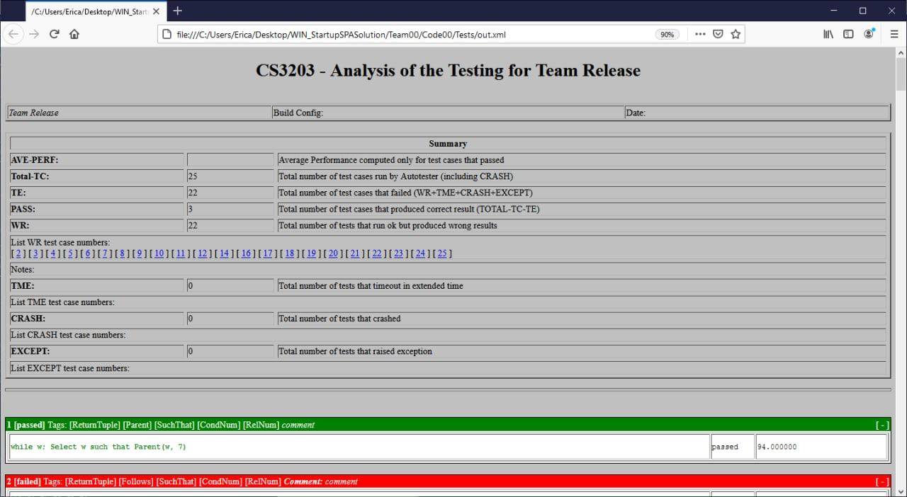
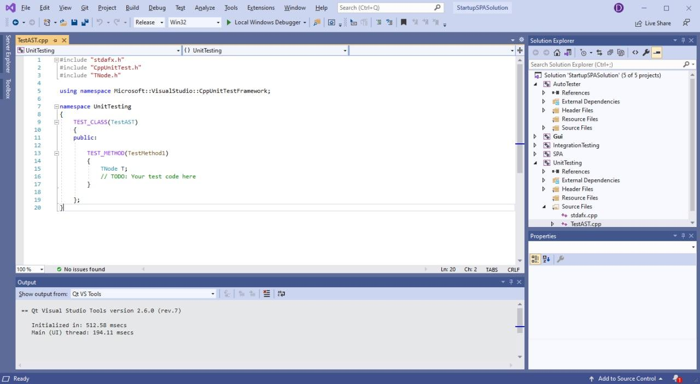
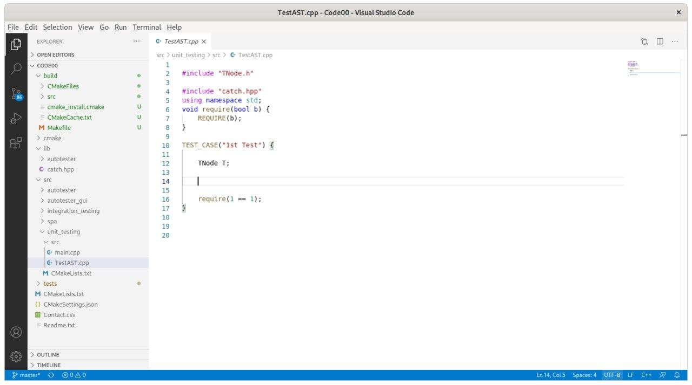

 

<frontmatter>
  layout: default.md
  pageNav: 2
  pageNavTitle: "Chapters of This Page"
</frontmatter>

This section covers the required integration and subsequent testing that you should have in your AutoTester project.

For platform-specific build-and-install instructions, please refer to [Windows Visual Studio Startup SPA Solution GitHub Wiki Page](../tools/windows-spa.html) and [Cross-platform Startup SPA Solution GitHub Wiki Page](../tools/cross-platform-spa.html) respectively.

1\. AutoTester
===============================

Your SPA implementation will be tested using an automated tester called AutoTester. The AutoTester is implemented in C++17, and it is integrated in your SPA Solution Project. The system testing during project evaluation is done using the AutoTester. Hence, integrate and use AutoTester as early as possible!

> Note that there are some features from previous versions of C++ that are removed and/or deprecated. Please avoid using these removed/deprecated features. However, if your team wishes to use a previous version of C++, be sure to ensure that you configure the previous version explictly in the compilation.

> **Q: Where is the Autotester main function?**
>
> **A:** You would not be able to find the main function in SPA Solution Project. You can think of it in this manner - the main function is in the client's code and the implementation is hidden from you. Your code will interface with the autotester via a well-defined API. In short, you should not change the AutoTester source files to add a method main, instead implement the API found in `TestWrapper.h`. See [1.5. Integration between SPA and AutoTester](../tools/autotester-testing.html#1-5-integration-between-spa-and-autotester) for more details.

1.1. Running the AutoTester
---------------------------------------------------------

    <Autotester-binary> <SIMPLE-source> <SIMPLE-queries> <output-xml> -f <query-id>

The AutoTester binary accepts three arguments and one optional argument:

1.  `<SIMPLE-source>` The file path of the SIMPLE source. This file contains the SIMPLE source code that will be analyzed in test format.
2.  `<SIMPLE-queries>` The file path containing the queries. This file contains the queries that have to be evaluated based on the SIMPLE source code. The file may contain multiple queries, one after another.
3.  `<output-xml>` The file path of the output xml from this run.
4.  `-f <query-id>` The specific Query-Id from which the tests will start the run from, referring to the query ids from `<SIMPLE-queries>` file.

The paths are dependent on the platform. After navigating to the location of the AutoTester, you can run AutoTester against the sample source code and queries. For example:

*   Mac/Linux via CMake: `./autotester ../../../tests/Sample_source.txt ../../../tests/Sample_queries.txt ../../../tests/out.xml`
*   Windows via VS: `.\AutoTester.exe ..\Tests\Sample_source.txt ..\Tests\Sample_queries.txt ..\Tests\out.xml`

1.2 Format of PQL queries & its results
---------------------------------------------------------------------------------

The file may contain multiple queries, one after another. Each query is defined using 5 lines, as shown in the following example. The text after → is for illustration and clarity of explanation, and should not exist in the queries file.

    1 - comment                       → Query ID and comment
    while w;                          → Declaration for PQL query
    Select w such that Parent*(w, 7)  → PQL query
    1, 4                              → Expected result of the query
    5000                              → Time limit (in milliseconds)

The Query ID should be unique, although the AutoTester will run though if there are non-unique Query IDs. The expected result of the query in the queries file must not have duplicates, e.g. AutoTester will not run correctly if in the above query, `4,1,4` is used instead of `1,4`.

The order of the results returned by your SPA is not important. The AutoTester will do the sorting of the results for you. The AutoTester will also remove any duplicates it finds in the answers returned by your SPA. For example, if you return the answers `["1", "3", "3", "2", "3"]`, the AutoTester will consider your answers to be just `["1", "2" and "3"]`.

Note that the results for procedure names and variable names are case-sensitive.

1.3 PQL Queries with empty results
------------------------------------------------------------------------

The AutoTester expects no results for a query if the query in the query file expects `none` as a result, or if there is a blank line. For example:

    1 - Impossible situation
    stmt s;
    Select s such that Follows*(s, s)
    none
    5000

    1 - Impossible situation
    stmt s;
    Select s such that Follows*(s, s)

    5000

When you implements `virtual void evaluate(std::string query, std::list<std::string>& results);` of `TestWrapper`, you must not insert any element into `std::list<std::string>& results`. Do not populate the list results with any values, not even the keyword `none`. ie. `results.size() == 0` must be true if there are no results.

1.4 Output XML
--------------------------------

The AutoTester will compare the results returned by your SPA with the expected results shown in the file and decide if the query passed (total match) or failed (results are not matched). Once the testing is completed, an XML file is generated and you can view the results by opening the file using a browser (shown above).

The XML would need the XML style file `analysis.xsl` to be in the same folder to be displayed correctly using the browser. You may find `analysis.xsl` in the `tests` folder of the startup solution.

To open the XML file, you would need to:

1.  In the file directory containing `.xsl` and `.xml` file, set up your own python local server in your command line. E.g.

    `python -m http.server 8000`

2.  In your preferred browser (e.g. Chrome, Firefox, Edge etc.), type in `localhost:8000` to access the file directory.

3.  Open the `.xml` file through the browser.

Remember to close your server in your command line. Alternatively, you do not need to set up your own python local server if you have Internet Explorer / Safari.

1.5. Integration between SPA and AutoTester
-----------------------------------------------------------------------------------------

To call your SPA code from AutoTester, you only need to implement the TestWrapper class (already located in the AutoTester project). The following is the source of TestWrapper.h:

    #ifndef TESTWRAPPER_H
    #define TESTWRAPPER_H
    #include <string>
    #include <iostream>
    #include <list>

    // include your other headers here
    #include "AbstractWrapper.h"

    class TestWrapper : public AbstractWrapper {

     public:
      // default constructor
      TestWrapper();
      // destructor
      ~TestWrapper();

      // method for parsing the SIMPLE source
      virtual void parse(std::string filename);

      // method for evaluating a query
      virtual void evaluate(std::string query, std::list<std::string>& results);

    };
    #endif

First, in the header file `TestWrapper.h`, include any other header files necessary for compiling the TestWrapper class. If you need to use instance variables in your implementation, create a private section in the class specification and declare your instance variables there. Next, you need to implement the 3 methods specified in `TestWrapper.h` by writing code for the methods in `TestWrapper.cpp`:

1.  The first method is the default constructor `TestWrapper()`, you can create objects that you will need later on for parsing and query evaluation. You can also do any initialization your need for your SPA here. Remember to also implement the destructor `~TestWrapper()`.
2.  For the method `virtual void parse(std::string filename);`, the AutoTester will pass the name of the SIMPLE source file through parameter "filename" of this method. What you need to do here is to write code that will invoke the parser/design extractor of your SPA to create the PKB components from the source file.
3.  For the method `virtual void evaluate(std::string query, std::list<std::string>& results);`, it has 2 parameters: query will contain the query string while results will store the answers to the query. Here, you will write code that will invoke your SPA to evaluate the query. The answers to the query will be subsequently stored in the results list.

The AutoTester works in a cooperative mode. In other words, instead of forcing your program to stop whenever the time limit is reached during the evaluation of a query, it will first signal to your program to stop. Then, it waits for a couple of seconds for your program to do any clean up e.g. deallocating memory. If your program returns within the extended time limit, the AutoTester will continue with the next query. Otherwise, it will print out a message to inform us that the program has refused to terminate, in which case we will forcefully terminate the whole testing and give a full penalty for that query. To do the checking of the stop signal, you need to add some code into your own SPA program as sketched out in the following pseudocode:

    #include "AbstractWrapper.h"
    .....
    for each query_clause in query do
      evaluator.eval(query_clause)
      if (AbstractWrapper::GlobalStop) {
        // do cleanup
        ....
        return
              }
    .....

However, in many instances it is impossible to catch and implement the GlobalStop, so no penalty is applied if you do not implement it.

2\. Unit/Integration Testing
==========================================================

Unit and Integration Testing in handled differently on Visual Studio and CMake, using different testing frameworks. You can read more in the links below.

1.  Windows Visual Studio Startup SPA Solution - [Visual Studio Testing Framework](https://docs.microsoft.com/en-us/visualstudio/test/writing-unit-tests-for-c-cpp?view=vs-2019#basic-test-workflow)
2.  Cross-platform Cmake Startup SPA Solution - [Catch2](https://github.com/catchorg/Catch2/blob/devel/docs/tutorial.md)

We have included some code stubs to start you off; screenshots are shown below for both project types. Fill in the test cases as needed for Unit Testing and Integration Testing.

3\. Query Timing Histogram
=======================================================

Query timings would be taken into consideration for grading. Please refer to wiki page \[Guidelines Grading\](Guidelines Grading)

The discussion below is on the average query timing across all queries and it will be used primarily for grading. However, we can use the histogram curves to distinguish teams that are close. In the case where the strategy cannot be applied (ie. MacOS cannot be built on Windows), we will use our discretion (ie. use the adjusted MacOS timings) to maintain fairness as much as possible.

We understand that different platform has different performance characteristics due to the differences in OS system calls and different compiler. Considering that, we will be using the following strategy to compare between teams:

*   All teams in each target platform would be consistently run on the same hardware with the same compiler/linker etc.

*   All teams that have chosen Windows to be their target platform would be considered the common platform for comparison. Windows is chosen as the platform for comparison as the majority of the teams' target platform is Windows. Timings on other platforms would be converted to a Windows equivalent timing as a point in the comparison. Here, we define some useful metrics to enable non-Windows timings to be adjusted. The average time difference between Windows and Mac timings is given below and will only be used to adjust other teams' timings.

    ,

    ,

    where  is the i-th SPA project timings on windows (project's target is Windows),  is the same i-th SPA project but run on MacOS,  is the same i-th SPA project but run on Linux,  is the set of SPA project which has Windows as its target platform.

*   All teams that have chosen MacOS to be their target platform would be built and run on both MacOS and on Windows. We will convert the MacOS timings to their Windows equivalents using the  computed previously. We will also compile and run the SPA project in Windows directly and take the minimum of the 2 timings - Windows equivalent timing converted from MacOS timing and Windows timing of the MacOS project, to be the finalized timing:

    ,

*   All teams that have chosen Linux would be processed in the same manner as the Mac teams, where instead of MacOS we will run on Linux and use the  instead.

*   Teams should not adjust the optimization flags and keep the configuration that was given. Optimization should be done through design.

4\. Parsing Time and Memory Usage
=====================================================================

Parsing time and memory usage would be taken into consideration for grading as the requirements of SPA as well. We discuss how to measure parsing time and memory usage in the subsequent subsections.

Parsing Time
-----------------------------

The XML file generated by the AutoTester contains parsing time. When opening the `out.xml` in a text editor, the following line would be shown.

    <parsing_time_taken>7.346000</parsing_time_taken>

Note the information is not shown when viewing the XML file using a browser.

Memory Usage
-----------------------------

We use a Python library `memory-profiler` to monitor the memory usage of the AutoTester. We provide instructions below if you are familiar with Python.

1.  Make sure you have Python >= 3.7 and matplotlib installed.
2.  Install memory-profiler library

    pip install -U memory-profiler

3.  Run AutoTester using the command below.

    mprof run -M -T 0.001 ./autotester ./Sample_source.txt ./Sample_queries.txt out.xml

4.  Check peak memory usage.

    mprof peak

5.  Plot memory usage vs. time.

    mprof plot

If you are not familiar with Python, we also provide a simple script `run_with_mprof.py` [here](../../archive/run_with_mprof.py). You can run the script using the following command:

    python run_with_mprof.py -c .\autotester .\Sample_source.txt .\Sample_queries.txt .\out.xml -t 0.001
